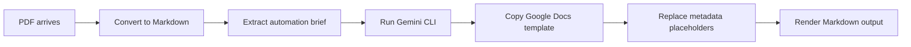

# GitHub Portfolio Repo Workflow

> 將一個不適合公開的內部專案改造成 portfolio-friendly GitHub repo，並保留原始版本可切回。

## 定位與用途

本頁記錄一次 repo repositioning 工作流：原本專案是「AI 幫我寫作業」的 assignment pipeline，不適合作為 portfolio；透過 Git branch 保留原始版本，另建 portfolio 分支改成 `document-automation-pipeline`，再推到 GitHub 新 repo。

適用場景：

- 想公開展示 automation 能力，但原專案語境不適合公開。
- 想保留原本完整版本，同時建立乾淨的 portfolio 版本。
- GitHub README Mermaid 圖表顯示 `Unable to render rich display`。

## Git 分支保存原始版本與 portfolio 版本

原本完整寫作業版本仍保留在同一個 repo 的 `master` 分支：

```powershell
cd D:\shane_yeh\Documents\_Claude_Code\assignment-pipeline
git switch master
```

portfolio 版本在分支：

```powershell
git switch codex/document-automation-portfolio
```

確認目前所在分支：

```powershell
git branch --show-current
```

本次 portfolio commit：

```text
e9abe8e feat: reposition as document automation portfolio
```

原本寫作業版本最後確認的 commit：

```text
e928865 fix: harden assignment pipeline processing
```

## GitHub 新 repo 推送流程

如果 GitHub 已建立空 repo `document-automation-pipeline`，且 URL 是：

```text
https://github.com/shane328/document-automation-pipeline.git
```

第一次設定 remote 並把本地 portfolio 分支推成 GitHub `main`：

```powershell
git remote add origin https://github.com/shane328/document-automation-pipeline.git
git push -u origin codex/document-automation-portfolio:main
```

如果已經有 `origin`，改用：

```powershell
git remote set-url origin https://github.com/shane328/document-automation-pipeline.git
git push -u origin codex/document-automation-portfolio:main
```

推送成功後，本地分支可能顯示 tracking `origin/main`：

```text
Your branch is up to date with 'origin/main'.
```

## README Mermaid 顯示問題修正

GitHub README 中 Mermaid 顯示：

```text
Unable to render rich display
```

常見原因是 GitHub 的 Mermaid renderer 對節點 label 或語法較挑。原本寫法：



更穩定的 GitHub 寫法：


修正 README 後提交並推送：

```powershell
git add README.md
git commit -m "docs: fix GitHub Mermaid pipeline diagram"
git push
```

## Codex / GitHub 工具限制

本次環境觀察：

- 本機沒有 `gh` CLI：`where.exe gh` 找不到。
- 沒有 `GITHUB_TOKEN` / `GH_TOKEN` 環境變數。
- Codex GitHub connector 可以查 repo、開 issue/PR、操作既有 repo 檔案，但本次可用工具沒有「建立新 repo」能力。
- 因此流程改成：本地先完成 branch + commit，使用者自行建立 GitHub repo 後，再用 git remote/push 指令推送。

檢查 repo 是否存在時，connector 查 `shane328/document-automation-pipeline` 曾回 404；使用者建立 repo 後推送成功。

## 常見問題 / 踩坑

- 原本版本不見了嗎？
  - 沒有。只要切回 `master` 就能看原本寫作業版。

- portfolio 版本在哪？
  - `codex/document-automation-portfolio`。

- 要把本地分支推成 GitHub `main` 怎麼寫？
  - `git push -u origin codex/document-automation-portfolio:main`

- `.worktrees` 裡的舊分支是否有需要保留的改動？
  - 檢查結果：功能分支 `codex/markdown-google-docs-formatting` 已被 `master` 包含，`git diff master...HEAD` 為空；未提交改動只剩 `src/assignment_pipeline.egg-info/SOURCES.txt` 這種打包 metadata。

- GitHub Mermaid 無法 render 怎麼修？
  - 使用 `graph LR`，並把 node label 全部寫成 quoted label：`A["PDF arrives"]`。

## 相關資源

- Git branch 切換：`git switch <branch>`
- Git remote 設定：`git remote add origin <url>` / `git remote set-url origin <url>`
- GitHub Mermaid diagrams: README 支援 fenced code block `mermaid`
